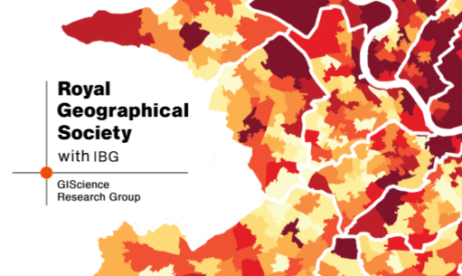

--- 
title: "RGS Annual International Conference"
author: Dr Justin van Dijk^[[mappingdutchman.com](https://mappingdutchman.com/)], Dr Stefano De Sabbata^[[sdesabbata.github.io/](https://sdesabbata.github.io/)]
date: "Last modified: `r Sys.Date()`"
site: bookdown::bookdown_site
output: 
  bookdown::gitbook:
    includes:
      in_header: header.html
documentclass: book
link-citations: yes
github-repo: "jtvandijk/RGSGIS22"
description: "RGIS GIScience Research Group"
url: 'https\://jtvandijk.github.io/RGSGIS22/'
---

# Sponsored Sessions AIC 2022 
<br />

```{r echo=FALSE, out.width = "100%", fig.align='center', cache=TRUE,}
 
```
<br />

The [Geographic Information Science Research Group](https://geoinfo.science/) (GIScRG) of the [Royal Geographical Society (with IBG)](https://www.rgs.org/) is a group of academics and practitioners interested in promoting GIScience, Geographic Data Science and GI Technology in geographical research, teaching and the workplace. 

The [RGS-IBG Annual International Conference](https://www.rgs.org/research/annual-international-conference/call/) regularly attracts over 2,000 geographers from around the world. This year, the conference is taking place at [Newcastle University](https://www.ncl.ac.uk/), with in-person, online, and hybrid ways to participate. 

This year the GIScRG is pleased to sponsor paper presentation sessions on the following topics that focus on geographic information science and tools, cartography, spatial analysis, critical GIS and related disciplines:

* Session 1: [Innovative GI methods in safety and emergency services research](session-1-safety-and-emergency-services.html)
* Session 2: [Deep learning applications in geography](session-2-deep-learning.html)
* Session 3: [Dealing with uncertainty: Quality and Representation in the context of Big Data](session-3-big-data-quality.html)
* Session 4: [Ethics within GIScience, including (but not limited to) the Locus Charter](session-4-ethics.html)

The deadline for abstract submission to each of these sessions is **March 18th, 2022.** Further to the paper sessions we also sponsor a [World Café](https://www.rgs.org/research/annual-international-conference/call/conference-session-formats/world-cafe/) session:

* Session 5: [Beyond the systems of geography information](session-5-world-café.html)

Click on the link to access the details of each sessions and to find out how to contribute to the session. Please note that the RGS has strict limits to the contributions of each delegate (see [Contribution limits](https://www.rgs.org/research/annual-international-conference/call/guidance-for-presenters/#Contribution%20limits)). There is no formal limit to the number of sessions chaired or the number of co-authorships. However, sessions are normally understood as open to submission of papers. A session only composed by members of your own team is unlikely to be approved by the RGS.
